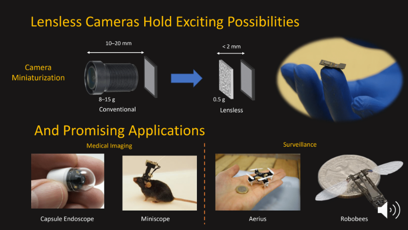

# How to update the websites

- The main page is present in `index.html`. Do not rename this file ! This is a reserved word.
- html pages for all other web pages that we create can be chosen at random and no restrictions on it.

# How to add projects to the main page of the lab webpage?
- Currently each row can accomodate 3 projects. This can be increased to 4 if desired. There is no restriction on the number of rows. 
- For each project the has to be added to the main page you need three things:
  - Title
  - One line description
  - An image of max resolution `height="150" width="350"`. This image may be placed in the `images` folder or can be provided as a link to some image on the internet
- Once you have these things ready, go to `index.html` and use the following template

```
<div class="row">
  
  <div class="4u">
    <section>
      <header>
        <h2>FlatNet</h2>
      </header>
      <p class="subtitle">Photorealistic Scene Reconstruction from Lensless Measurements</p>
      <p><a href="#"></a></p>
      <a href="https://siddiquesalman.github.io/flatnet/" class="button">Project Page</a>
    </section>
  </div>


  <div class="4u">
    ... ANOTHER PROJECT COMES HERE IN THE SAME ROW BUT ON THE 2nd COLUMN
  </div>


  <div class="4u">
    ... ANOTHER PROJECT COMES HERE IN THE SAME ROW BUT ON THE 3rd COLUMN
  </div>
					
</div>
```
